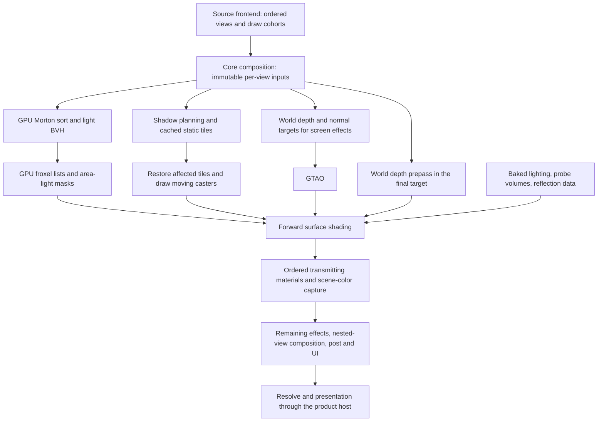

# Rendercore compared with id Tech and other Forward+ engines

Research note, 2026-10-02. This is a comparison of the implementation and retained
evidence, not a new rendering contract or a declaration that a roadmap gate passed.

**Our core has the right broad architecture for a fast clustered forward renderer,
but several of the mechanisms that make the reference engines fast are either
missing from its product path or remain expensive within it.** GPU clustering,
static shadow reuse, material specialization and depth rejection are already
present. The clearest remaining differences are coherent execution of the light
loop, the cost of shadow receivers, persistent resource bindings, geometry
submission, and scheduling across CPU jobs and GPU queues.

The strongest available performance evidence points at **shadow visibility inside
the surface shader**, rather than light assignment or GGX arithmetic alone.
That makes receiver work and the compiled surface program the immediate profiling
priority. GPU-driven geometry and asynchronous compute are meaningful longer-term
comparisons, but neither is a demonstrated explanation for the current slow view.

## Scope and evidence

The source audit began at Git revision
`450859dce19736e06dc7305da4da308c916e776a` and includes the active working tree.
Other sessions were changing and committing profiling, portal and resource-reuse
work during the audit. File links describe the observed implementation; this is
not a reproducible benchmark of a single clean revision. The measurements below
belong to their separately retained receipts. No new performance run was made for
this report.

Three kinds of statements are distinguished throughout:

- **Implemented:** supported by the current source and named consumer.
- **Measured:** supported by an existing run, with its workload and limitations.
- **Proposed experiment:** a plausible improvement whose full-frame benefit is
  unknown.

[RFC 0016](0016-render-core.md) owns the render architecture and acceptance rules;
[RFC 0003](0003-dependency-aware-job-system.md#cpugpu-execution-placement-user-decision-2026-10-01)
owns CPU/GPU placement. Historical “proposed” descriptions and old progress entries
must be read alongside the newer implementation. In particular, an early October 2
comparison says comparison samplers were missing; the subsequent implementation
and current source show that they have been added.

The external accounts describe specific engine versions and workloads: DOOM
2016, Doom Eternal's 2020 renderer, Detroit's 2018 talk and 2020 PC port, Infinity
Ward's 2020/2021 presentations, Epic's documented forward renderer, and Avalanche's
2013 clustered renderer. They do not establish the present implementation of
every game using those engine families.

## What our product pipeline actually does

The core is a migration beneath Source's existing material and view interfaces.
The game still supplies ordered view and draw work through the frontend. Core
world/model slots consume that work using core materials and the device port.
This compatibility boundary is useful, but it means the product is not yet a
single freely schedulable graph exposing every draw, resource and dependency.

The following diagram describes dependencies and major operations for a staged
world view. It is not a literal Vulkan submission trace: preparation and shadow
graphs can execute inside the larger frontend-driven sequence.

The implemented pieces are more specific than the phrase “Forward+” suggests:

| Area | Observed product behavior | Important qualification |
| --- | --- | --- |
| Light assignment | GPU Morton ordering, a bounded 32-way BVH, one 32-thread workgroup per froxel, conservative sphere/cone tests, ordered output indices, area-light masks | CPU publication, view setup and shadow planning still exist. GPU assignment does not mean all lighting preparation is GPU work. |
| View reuse | Same-frame, same-view cohorts share immutable lighting inputs/results and assignment buffers | Different projections, viewports and light revisions require distinct work. A portal is not automatically the main view. |
| Surface lighting | Shared surface program with specialization constants, direct light lists, baked/probe indirect light, reflection and material terms | Specialization removes absent terms; enabled terms can still produce a large compiled shader. |
| Shadows | Cached static depth, moving-caster composition, raw blocker sampling, hardware comparison filtering and direct world-cube face selection | Shadow-map generation and shadow receiving are different costs. Caching the former does not eliminate the latter. |
| Depth | Separate single-sample depth/normal targets for screen effects, plus an optional world depth prepass into the actual draw target | This is additional geometry work. The shown target-depth loop covers world surfaces, not a demonstrated unified prepass for every cohort. |
| Draw submission | CPU draw preparation, sorting, adjacent world-index run coalescing, explicit indexed draws for model/dynamic cohorts | There is batching already, but no id Tech 7-style GPU triangle compaction and geometry-set submission in the audited world path. |
| Execution | Product renderer and legacy-frame executor select the serial graph executor | A pooled executor exists, but the native Vulkan adapter does not claim parallel native recording or asynchronous queues. |
| Resource reuse | Cached material pipelines/resources, graph transients, and newly completion-safe world group-buffer/sampler reuse | Descriptor-group recreation and repeated uploads remain documented follow-up work. |

Source: [core composition](../render/composition/core_world.cpp),
[world pass](../render/pass/world/world_pass.cpp),
[light kernels](../render/pass/lights/cluster_assign.comp),
[surface program](../render/material/families/surface_program.glsl),
[renderer](../render/renderer/renderer.cpp), and
[legacy frame executor](../render/legacy/frame_executor.cpp).

### Forward shading still has screen-space inputs

RFC 0016 prohibits a screen-space material G-buffer followed by deferred material
lighting. That does not prohibit a depth/normal target for AO, reflection inputs,
or a scene-color copy for transmission. The current world pass has such auxiliary
targets. Describing it as “no G-buffer” without that distinction would obscure
real bandwidth and geometry costs.

The architecture also does not establish complete product coverage. The
[gallery review](0016-gallery-review-2026-10-01.md) records remaining lighting
differences, and the [progress record](0016-progress.md) separately tracks model,
portal, transparency and other frame cohorts. Core-only mode rejects unsupported
legacy shader work; absence from the resulting frame cannot count as a performance
improvement. K11 lighting correctness, K12 game/lab parity and R91 frame completion
remain separate from this architecture comparison.

## The reference engines and their most useful lessons

### id Tech 6: make the forward shader execute coherently

The 2016 renderer used a coarse 16×8×24 logarithmic cluster grid built with CPU
jobs. Its forward opaque pass emitted lighting plus a thin G-buffer, with later
screen-space work. Sorted light/decal lists enabled wave-coherent traversal and
scalar data loads. The talk reports about 30% improvement in opaque shading on
PS4 for scalarization, while incoherent particle workloads could lose. Register
pressure and shader occupancy were explicit design concerns; particle lighting
could run in a separate small atlas. These are workload-specific mechanisms and
measurements, not a universal Forward+ multiplier.
[Sousa and Geffroy, SIGGRAPH 2016](https://www.advances.realtimerendering.com/s2016/Siggraph2016_idTech6.pdf).

Our closest similarity is the clustered material shader with reusable shadow and
indirect-light inputs. Our most actionable difference is that the current fragment
shader independently walks its own list. Moving assignment to the GPU has not
addressed that execution pattern. The auxiliary-target comparison also matters:
our explicit forward-material policy is different from the published hybrid
arrangement; copying its pass layout wholesale would be an architectural change.

The Vulkan account adds a separate lesson: frame contexts, job-based command
recording, cached descriptor sets, dynamic uniform allocation, pipeline preparation
and asynchronous overlap reduced costs surrounding shading.
[Gneiting, Porting DOOM to Vulkan, pp. 78–106](https://www.khronos.org/assets/uploads/developers/library/2016-siggraph/3D-BOF-SIGGRAPH_Jul16.pdf).
Our work on fenced resource reuse is in that direction, but it does not yet supply
the whole submission and scheduling model.

The developers also describe static lightmaps, dynamic irradiance volumes and
image-based specular lighting, with screen-space approximations. That is broadly
similar to our mixture of baked and runtime terms. Their account emphasizes a
renderer and content pipeline designed around DOOM and a focused platform set.
Our retained Source material, content and view compatibility creates additional
constraints that must be paid down deliberately.
[Sousa/Gneiting interview, July 2016](https://www.dsogaming.com/interviews/id-software-tech-interview-dx12-vulkan-mega-textures-pbr-global-illumination-more/).

### id Tech 7: cull more precisely and submit less geometry

The 2020 presentation describes GPU coarse/fine light-volume rasterization,
256×256 coarse tiles, 32×32 fine tiles, conservative depth bounds and point-light
refinement. Fragments choose the shorter of a cluster list and a tile list;
list hashes support coherent loads despite finer spatial granularity. Geometry
processing rejects back-facing, outside-frustum, tiny and occluded triangles,
then compacts indices. Up to 256 meshes sharing a PSO form a geometry set, with
the generated indices reused for depth and opaque rendering.
[Geffroy, Gneiting and Wang, SIGGRAPH 2020](https://advances.realtimerendering.com/s2020/RenderingDoomEternal.pdf).

Our GPU light BVH is a different algorithm. It is not an incomplete copy of that
rasterizer, and the reference does not establish that replacing it would be
faster here. The useful missing behaviors are depth-informed list refinement and
wave coherence, subject to measurement. On geometry, the difference is larger:
our audited product path still prepares and submits explicit draw ranges on the
CPU. That makes geometry submission a credible future work area, especially for
dense content, without proving that it dominates today's receiver-heavy scene.

### Detroit: clustering alone did not fix expensive shaders

Detroit's talk describes an initially expensive clustered renderer improved by
light-loop organization, view-space calculations, scalarization, early rejection,
and moving sun-shadow work outside the local-light loop. Its hierarchical cluster
construction overlaps other GPU work. It also uses quality-dependent shadow and
transparency approximations, which must be distinguished from equivalent-output
optimizations.
[Marchalot, GDC 2018](https://media.gdcvault.com/gdc2018/presentations/Marchalot_Ronan_ClusteredRenderingAnd.pdf).

The PC-port authors explicitly credit id's coherent lighting approach. Their
render lists record through jobs while maintaining execution order; they discuss
barriers and asynchronous compute as separate responsibilities. Their article
also retracts a noncompliant InstanceID trick, a useful reminder to preserve API
semantics when optimizing.
[Quantic Dream/AMD, Porting Detroit, part 3](https://gpuopen.com/learn/porting-detroit-3/).

This is the closest cautionary comparison for us: the name of the lighting
architecture says little about the final shader's register use, divergence and
memory behavior. We already reject zero falloff and back-facing light contributions
before shadow filtering. Recommending that as a new optimization would miss the
current code. The remaining questions concern what the compiler produces and
whether neighboring fragments can share coherent execution.

### Infinity Ward: control where and how often shading runs

Modern Warfare's software variable-rate shading predicts required shading density,
packs work into compute kernels and reconstructs the result. The later 2021
geometry talk describes merged intermediate geometry and a combination of Forward+
and visibility-buffer techniques designed around that shading system.
[2020 software VRS](https://research.activision.com/publications/2020-09/software-based-variable-rate-shading-in-call-of-duty--modern-war),
[2021 geometry architecture](https://research.activision.com/publications/2021/09/geometry-rendering-pipeline-architecture).

Our present path shades rasterized surfaces directly and does not implement that
packing/reconstruction architecture. Its lesson is broader than “enable VRS”:
useful shader invocations and active execution lanes matter. However, reducing
shading frequency changes the sampling scheme. It is not an authorized shortcut
to our fixed-quality acceptance target. A visibility-buffer rewrite would also
be a much larger architectural decision than the bounded receiver work supported
by current evidence.

### Unreal: material specialization helps, but compare equal features

Epic's forward renderer culls lights and reflection captures into a frustum grid.
Expensive material features are opt-in. The documented Robo Recall comparison is
about 22% faster on a GTX 970, with much of the gain attributed to choices such as
simpler default reflection capture evaluation, vertex fog and opt-in planar
reflections. Epic also discusses MSAA as a workload-dependent cost.
[Epic forward-renderer documentation](https://dev.epicgames.com/documentation/en-us/unreal-engine/forward-shading-renderer-in-unreal-engine).

Our specialization constants already express which terms a material needs. That
is a useful similarity. Turning off terms that contribute to the intended image
would be a separate quality decision. The reflection comparison suggests a more
appropriate experiment: reduce candidate lookup cost while preserving the
existing selection and blend result.

### Avalanche: tight candidates and shared lighting data

Persson's presentation describes clustered lighting shared with forward passes
in an engine that remained principally deferred. Compact indices, logarithmic
depth subdivision and tighter sphere intersection reduce unnecessary work. It
is a useful clustered-lighting reference, not evidence of a wholly forward
Avalanche renderer.
[Practical Clustered Shading, 2013](https://www.humus.name/Articles/PracticalClusteredShading.pdf).

Our sphere/cone refinement, ordered compact output and shared per-view inputs
already follow the same general principles. Candidate quality still depends on
authored influence bounds. Conservatively retaining a broad light can be correct
even when the resulting list is inconveniently long.

## Light assignment: present, conservative, and worth measuring in context

The current [GPU build](../render/pass/lights/cluster_build.comp) sorts up to
1,024 admitted point/spot records into Morton order, then constructs 32 bounding
groups. The [assignment kernel](../render/pass/lights/cluster_assign.comp)
traverses those bounds and performs tighter leaf tests. It writes accepted lights
in original light-set order, not traversal order. Area lights use two 32-bit masks.

The desktop grid policy is currently 64-pixel tiles and 24 depth slices. At
1920×1080 this is 30×17×24 = 12,240 froxels. Unlike a fixed screen-grid count,
the number grows with resolution. The active surface preparation also overrides
the generic list limits: it reserves enough indices for every admitted light in
every froxel, avoiding silent per-cell truncation.
[Grid policy](../render/pass/lights/clusters.cpp),
[`PrepareSurfaceClusterDispatch`](../render/pass/lights/cluster_pass.cpp).

That has a concrete memory tradeoff. At the stated resolution and 1,024 lights,
the index payload alone reserves 12,240×1,024×4 bytes, approximately **47.8 MiB
per assignment**. This is a calculation from the allocation policy, not a
measurement of current map usage; buffers, area masks and concurrent views add
other storage. Actual sparse membership does not reduce that reservation.
Compact allocation or lossless list sharing could be useful if memory pressure
or allocation bandwidth is measured, but must retain capacity correctness and
completion-safe lifetimes.

The [retained assignment benchmark](0016-gpu-light-assignment-2026-10-01.md)
reports 0.160 ms for GPU upload/build/assignment with 43 lights and 4,590 froxels;
host preparation/submission/wait was 0.536 ms. Neither number is a full-resolution
product-frame timing. It demonstrates why both GPU duration and total handoff
cost matter. It does not explain a roughly 60 ms full GPU frame by itself.

There is also a content constraint. The October 2 audit found broad and unbounded
legacy light support in the selected map. Tighter geometry tests cannot reject
a light that really contributes under its attenuation model. A depth-refined
opaque list would need a separate conservative rule for transparent surfaces and
nested views; opaque depth alone cannot justify deleting their lighting.

**Recommended comparison:** retain the current assignment as the production
baseline. Measure list-length distributions, assignment bytes and time per real
view before testing finer tiles, depth refinement or lossless list sharing.
Do not replace the algorithm merely because another engine uses a different one.

## Shader execution: the largest architectural opportunity inside the current path

The current clustered loop fetches the fragment's `(offset, count)`, loads each
light by index, evaluates attenuation and cone membership, rejects nonpositive
contributions, evaluates shadow visibility, then accumulates diffuse/specular
light. It contains no subgroup traversal in the audited surface source.
[Surface lighting loop](../render/material/families/surface_program.glsl).

Two neighboring fragments can therefore load different records and take different
branches. A short candidate list does not guarantee cheap execution: incoherent
addresses, long-lived temporaries and expensive branches can still dominate.
The already ordered lists provide a useful starting point for a wave-coherent
experiment, because active lanes can advance through a common light order.

That experiment belongs in `render.material`, with the required capability
expressed through `render.device`. It needs tests for empty and disjoint lists,
partial waves, helper invocations, subgroup-size variation and the complete
lighting model. It must preserve each fragment's membership and accumulation
semantics. A fixed 32-thread assignment workgroup is not proof that a fragment
shader executes in a 32-lane subgroup on every backend.

The current program already specializes its material terms and caches variants.
“Split the giant shader” is therefore too vague a recommendation. First map the
expensive compiled variants to actual draws and measure their instruction count,
register allocation, occupancy and duration. The retained RADV compiler capture
found programs with up to 192 VGPRs and roughly 56 KiB of code, but did not map
those programs to individual passes or measure dynamic occupancy. That evidence
justifies investigation; it does not prove a particular variant is the bottleneck.

Two tempting changes have already failed to establish a repeatable benefit:
sharing a prepared GGX/Smith context across light evaluations, and skipping BRDF
work after the full shadow filter produces exactly zero. Both were removed.
The [BRDF investigation](../quality-results/forward-plus-implementation-20261002/brdf-analysis.json)
and [progress account](0016-progress.md#k11k12-gpu-attribution-and-brdf-trials-2026-10-02)
should prevent those trials from being rediscovered as untested fixes.

## Shadows: distinguish producing depth from sampling it

The core already caches static shadow tiles and composites moving casters.
Composition checks the relevant views and caster state, restores affected depth,
and redraws changed work. This reduces repeated rasterization.
[`DrawStageShadows`](../render/composition/core_world.cpp),
[shadow passes](../render/pass/shadows/shadow_passes.cpp).

The receiver still pays for soft visibility at each contributing surface sample.
The shared [shadow helper](../render/shaders/common/shadow_sample.glsl) retains
sixteen blocker-search samples and sixteen comparison-filter samples for its
soft-shadow path. A point light can require cube-face handling; area-light shadow
groups have their own projection behavior. Static depth reuse does not make these
per-fragment operations free.

Hardware comparison sampling and direct world-cube face selection have already
landed. The reference implementation preserved the full filter and tested it
against an independent integer-addressed oracle after finding an instability in
the previous manual gather. These should be counted as existing improvements,
not proposed work.

The strongest diagnostic disables only receiver visibility while leaving shadow
production, falloff and BRDF evaluation enabled. Arrival GPU median drops from
about 61 ms to 23.8 ms. This implicates receiver work **and the changed shader's
resource behavior**; it does not isolate an additive 37 ms pass, and it changes
the image. Even the modified frame remains above the target.
[Receiver implementation and profiling evidence](0016-progress.md#k11k12-reference-shadow-operations-implementation-2026-10-02).

A promising bounded experiment is conservative early classification of a complete
filter footprint. A proven fully lit or fully blocked region could avoid the
expensive filter; uncertain regions would execute the unchanged filter. This is
a hypothesis, not an implemented guarantee. Any bounds structure has construction,
storage, invalidation and lookup costs, and soft penumbra footprints complicate
the proof. The ongoing receiver microbenchmark is a better place to resolve this
than replacing the shadow model in the game.

Moment shadows, fewer taps, reduced atlas resolution or slower updates may be
useful techniques elsewhere, but they alter our current visibility model or
quality. They do not satisfy an equivalent-output optimization claim by default.

## Geometry and depth: there is batching, but substantial CPU work remains

The [world pass](../render/pass/world/world_pass.cpp) coalesces compatible,
adjacent index ranges. Static/posed draws are partitioned so opaque work can sort
by material while blended work retains its required order. It would be incorrect
to describe this as one completely unbatched draw per triangle or surface.

However, draw-list traversal and material binding remain CPU operations, and
model/dynamic cohorts issue explicit indexed draws. The [scene module](../render/scene/scene.cpp)
has serial and job-based CPU visibility/list construction. Those mechanisms are
different from GPU triangle rejection, index compaction and generated geometry
submission. Likewise, the existence of a compute-skinning feature does not prove
every product posed-model route uses it; the staged model path still contains a
CPU skinning operation in `CoreWorld::PoseModel`.

The world also has two distinct depth-related operations: a single-sample
depth/normal pass for screen effects, and depth-only drawing into the final
target to reject hidden lit fragments. Their different sample counts and uses
mean they cannot simply share the same image. Nonetheless, duplicated geometry
work, incomplete prepass cohort coverage and transitions deserve measurement.
The right question is whether the depth work saves more expensive shading than
it costs over the complete scene.

A future GPU-driven slice should start with a bounded opaque cohort, preserve
material and view semantics, and reuse generated geometry wherever valid.
Transparent ordering, portal clipping/stencil, animated bounds, depth/shadow
coverage and failure behavior are acceptance requirements. They are not details
to postpone until after a fast synthetic draw benchmark.

## Scheduling and resource lifetime: infrastructure exists ahead of integration

The [renderer](../render/renderer/renderer.cpp) owns a `SerialGraphExecutor`.
The [legacy executor](../render/legacy/frame_executor.cpp) also uses serial
execution to preserve ordered side effects. The [pooled executor](../render/graph/executor_pooled.cpp)
can record independent encoders through jobs, then submit them in graph order,
but all its encoders currently target the graphics queue.

The [Vulkan adapter](../render/device/vulkan/device.cpp) explicitly does not claim
parallel native recording, asynchronous queues or transient aliasing. Its
`BeginEncoder` rejects non-graphics queues; [submission](../render/device/vulkan/encoder.cpp)
uses the graphics queue and completion timeline. A separate presentation family
on some devices is not an asynchronous compute implementation.

Consequently, a compute pass, a graph node and a pooled CPU executor are three
different capabilities. None alone demonstrates overlapping GPU work. The
comparison with the reference engines supports exposing real dependencies and
resource lifetimes before adding overlap. Async work can also compete with the
same bandwidth and registers as graphics; only a shorter measured critical path
establishes a win.

Resource lifetime is a current strength of the design. The new world-group cache
reuses buffers only after the covering completion token, matches size/usage,
preserves prior resource state, and excludes borrowed assignment buffers. Its
bounds are cache bounds, not draw limits. This is a useful foundation for reducing
descriptor and upload churn without unsafe fixed-frame retirement.

The retained 32-view synthetic workload reduced acquisition median from
50.825 to 1.814 microseconds and total median from 759.417 to 571.544 microseconds.
Those are resource-workload results; the one-view total p95 was worse, and no
complete-frame gain was certified.
[Resource-reuse evidence](0016-progress.md#k5-completion-safe-world-group-resource-reuse-2026-10-02).

Pipeline caching has a similar distinction. The surface program reuses live
pipeline objects by key, but the audited native `vkCreateGraphicsPipelines` and
`vkCreateComputePipelines` calls pass `VK_NULL_HANDLE` as the Vulkan pipeline-cache
argument. This is not proof of no driver caching; it means the inspected core
does not supply an application `VkPipelineCache` there. Measured first-use shader
and pipeline hitches would justify a bounded preparation/cache improvement.
[Surface pipeline cache](../render/material/surface_program.cpp),
[native pipeline creation](../render/device/vulkan/pipelines.cpp).

## Indirect lighting, reflections and portability

Forward+ controls direct-light candidates; it does not automatically optimize
probe selection, reflection visibility, AO or runtime indirect-light production.
Our [probe-volume shader](../render/shaders/common/probe_volume.glsl) and
[reflection-probe shader](../render/shaders/common/reflection_probes.glsl) have
their own lookup and blending work. Reflection selection scans serialized ranks
to choose and weight its samples. A conservative candidate structure could reduce
that search while preserving priority, global-probe fallback and the exact
selection result. This is especially worth investigating in scenes with many
probes, rather than assuming direct-light clustering solved it.

The existing [October 2 source comparison](0016-progress.md#k11k12-forward-source-comparison-and-rejected-receiver-trials-2026-10-02)
also inspected pinned Godot, Filament and Wicked Engine revisions. It records
hardware PCF, coherent traversal, probe candidate selection and alternate blocker
estimation. Its subsequent implementation section supersedes the missing-PCF
finding; its remaining ideas should be evaluated against our current model.

Our platform scope is broader than the one native GPU used in these profiles.
Device capabilities should make supported operations explicit, with shader and
backend conformance on the claiming profile. A desktop-only subgroup assumption,
large worst-case light buffer, fixed resource cache or extra queue cannot silently
become a requirement of every mobile/Apple path. Current Vulkan desktop evidence
does not establish Android, MoltenVK or iOS performance. This follows the existing
platform contracts rather than requiring a new renderer-specific platform matrix.

## What the timings do and do not show

The corrected `p2` capture below used `sp_a1_intro4_probe64` on Radeon 8060S
(RADV STRIX_HALO), with 4× MSAA and the recorded High settings. These are warmed
camera-route diagnostics with profiling enabled, not a completed full-gameplay
or complete-cohort acceptance run.

| Retained observation | Supported conclusion | Unsupported conclusion |
| --- | --- | --- |
| Corrected native 1920×1080 run: arrival GPU median 60.574 ms; reverse 23.131 ms; bracket p99 61.598 ms and max 61.861 ms | The measured workload misses the High target by a large margin | These are the timings of every map, the current changing checkout, or another engine on equivalent content |
| Receiver visibility disabled: arrival GPU median about 23.8 ms | Receiver evaluation and shader-resource effects deserve priority | Turning shadows off is an optimization or the difference is an independently timed pass |
| Visibility/IBL/SSR disabled: full direct BRDF 17.429 ms versus diffuse-only 14.114 ms | Direct specular has a measurable cost in that diagnostic | GGX alone accounts for the full-frame deficit; diagnostic differences can be added |
| Hardware-PCF/cube-face before/after windows improved roughly 11–12%, but rendered at 1920×1043 | Useful relative diagnostic evidence on that workload | A valid 1920×1080 High acceptance run |
| Small assignment and resource microbenchmarks improve | Their named operations are improved under those conditions | The full game now meets its frame floor |

Sources: [corrected run](../quality-results/forward-plus-implementation-20261002/p2/report.json),
[BRDF diagnostics](../quality-results/forward-plus-implementation-20261002/brdf-analysis.json),
and the linked progress entries above. Raw receipts under `quality-results` are
local retained artifacts and may not accompany a checkout of this document.

The existing P2:CE comparison is contextual: observed PBR materials and matching
cameras do not equalize baking, reflection, shadow, model and portal policies.
Its presented intervals also are not our GPU query durations. The public id and
other-engine measurements differ still further in hardware, content and quality.
None supports a numerical “our renderer is N times slower because of X” claim.

The authoritative [High budget](0016-render-core.md#hard-render-budgets-user-decision-2026-10-01)
requires the complete image at 1920×1080 and 4× MSAA, with every in-route presented
interval meeting the 120 FPS floor. Medians, isolated passes and incomplete
cohorts cannot certify it. MSAA also does not imply that every pixel executes the
entire shader four times; coverage, sample shading, edges and the actual pipeline
state determine its cost. It needs measurement, not multiplication by four.

## Recommended experiments within the existing work order

These are proposed investigations, not new roadmap rows. They fit beneath the
existing requirement to finish the lighting model, game/lab parity and complete
frame cohorts. Each change must first work in `render_lab`, use its existing owner,
and retain the complete production image.

| Priority | Bounded experiment and owner | Evidence required to keep it |
| --- | --- | --- |
| 1 | Attribute receiver cost to actual surface variants; investigate conservative receiver shortcuts in `render.pass.shadows` and shader live ranges in `render.material` | Exact filter/visibility semantics within the existing oracle; compiled-variant attribution; repeated full-image timings at matched clocks and quality |
| 2 | Coherent light traversal in `render.material`, with explicit device capability support | Correct per-fragment membership/order under adversarial lists and subgroup conditions; no regression on incoherent workloads; full-frame benefit |
| 3 | Reduce descriptor recreation and unchanged uploads through the current world/material owners | Allocation/upload counts, real completion-token lifetime tests, identical nested-view images, route CPU and tail-latency improvement |
| 4 | Audit both depth operations and cohort coverage in `render.pass.world`/composition | Overdraw and prepass timings; full AO, cutout, MSAA and portal correctness; lower complete cost rather than only a cheaper prepass |
| 5 | Refine light/probe candidates only where list statistics show waste | Conservative coverage, no attenuation truncation or probe-selection changes, total build/storage/shading cost across real views |
| 6 | Introduce a bounded GPU-driven opaque geometry cohort through scene/pass/device owners | Equivalent visible geometry and ordered effects; measured CPU and GPU savings on dense content; correct depth/shadow reuse |
| 7 | Qualify parallel native recording and a specific async overlap opportunity in device/graph owners | Declared capabilities, dependency/lifetime tests, native validation and an actual reduction of the critical path under contention |

Use the existing [profiling workflow](../tools/quality/render_profile.md) to keep
delayed GPU samples attached to their originating frames. Nested inclusive scope
means are not additive pass durations. Encoder counts are not camera counts.
Record actual drawable extent, complete feature/cohort coverage, power/clocks and
the exact source/build for each comparison. A speedup must survive those controls
and the full frame-floor check; a source-level simplification is not enough.

## Research files and verification

The downloaded source collection is at
[`/home/john/Downloads/idtech-rendering-research/`](</home/john/Downloads/idtech-rendering-research/>).
Its [source index](</home/john/Downloads/idtech-rendering-research/SOURCES.txt>)
distinguishes original slides, extracted speaker notes and recording transcripts.
The id Tech 6/7 renderer PowerPoints contain speaker notes; these are not verbatim
recording transcripts. The four downloaded recording transcripts are automatic
captions from complementary talks/interviews and may misrecognize technical terms.
The renderer details above rely primarily on the original presentations and
developer accounts, not caption wording.

This report was checked against the named source files and retained evidence;
local file links and formatting were checked after writing. It changes no engine
code, profile, quality setting, RFC contract or roadmap acceptance state. No new
runtime, image, hardware or performance acceptance is claimed.
